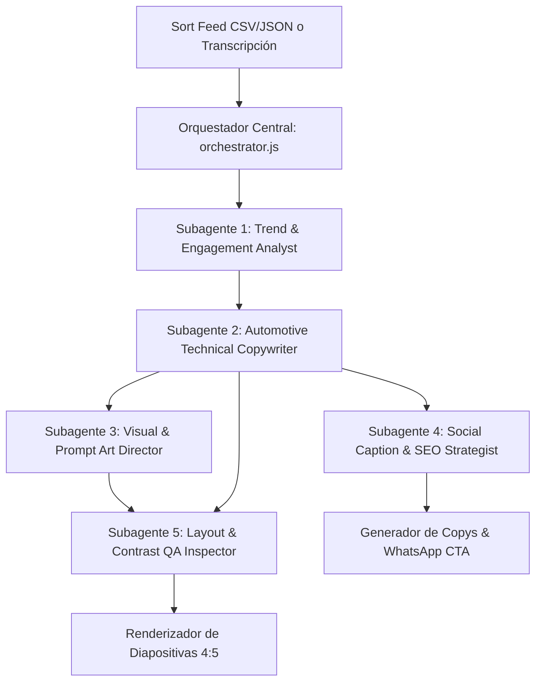

# 🏎️ DOSSIER MAESTRO DE TRASPASO DE CONTEXTO (AI HANDOVER)
# PROYECTO: RPM CAROUSEL STUDIO — REPUESTOS RPM

> **Instrucción para la IA:** Este archivo contiene el 100% del contexto técnico, estratégico, visual y de negocio del proyecto **RPM Carousel Studio**. Léelo completamente para continuar el desarrollo, generar nuevos carruseles, crear campañas o mantener el software sin necesidad de consultar otros archivos.

---

## 📌 1. RESUMEN EJECUTIVO DEL PROYECTO

**RPM Carousel Studio** es una aplicación web interactiva desarrollada en **React 18 + Vite + Tailwind CSS** para la empresa automotriz **Repuestos RPM** (ubicada en Quilpué y Viña del Mar, Chile).

Su objetivo es transformar transcripciones de videos virales y archivos exportados desde la extensión de Chrome **Sort Feed** en **carruseles de Instagram profesionales de alta conversión en formato 4:5 (1080 × 1350 px)**, con ritmo visual variado, fotografía de estudio 8K generada por IA y embudo directo de cierre de ventas hacia **WhatsApp (+56 9 7546 7525)**.

- **Repositorio Oficial en GitHub:** https://github.com/AlexCastro015/rpm-carousel-generator
- **Estado de Pruebas:** 45/45 tests automatizados aprobados (100% éxito en `node test_suite.js`).
- **Estado de Compilación:** Compilación en producción exitosa (`npm run build`).

---

## 🛡️ 2. REGLAS DE NEGOCIO INVIOLABLES (REPUESTOS RPM)

Cualquier IA o desarrollador que genere contenido, código o estrategias para Repuestos RPM debe cumplir estrictamente estas reglas:

1. **REGLA DE REPUESTOS 100% NUEVOS:**
   - ❌ **ESTRICTAMENTE PROHIBIDO:** Mencionar, sugerir o vender repuestos usados, de desarme o desarmadurías.
   - ✅ **ENFOQUE OFICIAL:** Solo repuestos 100% nuevos, garantizados, en caja de fabricante con tolerancias de fábrica.
2. **REGLA DE NO INSTALACIÓN DIRECTA:**
   - ❌ **PROHIBIDO:** Ofrecer servicios de taller mecánico o instalación en tienda (*ej: "te lo instalamos gratis"*).
   - ✅ **ENFOQUE OFICIAL:** Repuestos RPM es comercializadora y distribuidora de repuestos. Los clientes compran y retiran en tienda o piden despacho para su mecánico de confianza.
3. **CANAL OFICIAL DE CONVERSIÓN:**
   - **WhatsApp Oficial de Ventas:** `+56 9 7546 7525`
   - **Formato de Solicitud al Cliente:** Para cotizar con 100% de compatibilidad, pedir siempre los 4 datos:
     1. Marca y Modelo
     2. Año del vehículo
     3. Cilindrada / Motor
     4. (Opcional) Foto del padrón o número de chasis (VIN).
4. **LOCALES FÍSICOS CON RETIRO INMEDIATO:**
   - **Quilpué:** Chorrillos 782, V Región.
   - **Viña del Mar:** Local 11, Galería San Antonio (Av. San Antonio 1445), V Región.
5. **DISPONIBILIDAD Y PLAZOS:**
   - Stock local inmediato en tiendas.
   - Si no hay stock en el local, los pedidos a bodega central llegan en **2 a 3 días hábiles**.

---

## 🎨 3. BRAND KIT Y SISTEMA DE DISEÑO OFICIAL

### Paleta Cromática Institucional:
- **Dark Steel (Fondo Principal):** `#15181C` / `#0B0D10`
- **Superficie de Tarjeta (Card UI):** `#1A1E23` / `#1F242A`
- **Amarillo RPM (Acento de Marca & Botones):** `#FFC400`
- **Amarillo Hover:** `#FFD13A`
- **Texto Primario (Off-White):** `#F7F7F7`
- **Texto Secundario (Gris Técnico):** `#AAAAAA` / `#8E95A0`
- **Bordes Técnicos:** `#2B3036`

### Tipografías del Sistema:
- **Titulares & Números de Impacto:** `Barlow Condensed` (Bold / Extra Bold / Black, Uppercase).
- **Cuerpo, Subtítulos y Diagnóstico:** `Inter` (Regular / Medium / Semi-Bold).
- **Datos Técnicos & Etiquetas:** `JetBrains Mono` / Monospace.

### Proporción Instagram:
- **Ratio Vertical:** `4:5` (`1080 × 1350 px`).
- **Margen de Seguridad:** `48 px` en los 4 bordes para evitar solapamientos con la interfaz de Instagram.

---

## 📱 4. LOS 7 ARQUETIPOS VISUALES DE INSTAGRAM (`SlideCanvas.jsx`)

Para que el carrusel tenga **ritmo visual editorial** y no se sienta plano ni repetitivo, la aplicación renderiza 7 tipos de diapositiva:

1. **`hook` (Portada Editorial de Impacto):**
   - Badges de alerta fluorescente, titular magnético de gran escala, fotografía 3D flotante con resplandor en *Amarillo RPM* y barra inferior de advertencia.
2. **`stat` (Métrica / Dato Crítico):**
   - Número gigante central (*ej: 2 MM, 80.000 KM, 90°C*) para detener el scroll de Instagram, con etiqueta técnica y diagnóstico de riesgo preventivo.
3. **`vs` (Comparativa de 2 Columnas / Antes vs Después):**
   - Tarjetas de alto contraste: `❌ ERROR FATAL / PIEZA USADA` vs `✅ SOLUCIÓN REPUESTOS RPM 100% NUEVOS`.
4. **`checklist` (Test de Diagnóstico Rápido):**
   - Lista interactiva de verificación de síntomas mecánicos (*"¿Tu auto presenta más de 2 de estos síntomas?"*).
5. **`quote` (Regla de Oro / Consejo de Autoridad):**
   - Tarjeta técnica destacada con comillas de impacto, borde perimetral resplandeciente y firma técnica de Repuestos RPM.
6. **`point` (Diagnóstico & Solución Estándar):**
   - Paso numerado con foto de detalle, diagnóstico del síntoma y caja de conclusión *"💡 Consejo RPM"*.
7. **`cta` (Cierre WhatsApp de Alta Conversión):**
   - Mockup con botón interactivo de WhatsApp (`+56 9 7546 7525`), sellos de garantía de repuestos 100% nuevos y locales de Quilpué y Viña del Mar.

---

## 🤖 5. PIPELINE SUBAGÉNTICO AUTÓNOMO (`src/utils/agents/`)



### Roles y Responsabilidades:
1. **`trendAnalystAgent.js` (Trend & Engagement Analyst):** Analiza métricas de Sort Feed (vistas, likes, comentarios), filtra muletillas y detecta ganchos virales.
2. **`copywriterAgent.js` (Automotive Technical Copywriter):** Distribuye la información en una secuencia dinámica (`hook` $\to$ `stat` $\to$ `vs` $\to$ `checklist` $\to$ `quote` $\to$ `cta`) con el tono técnico de Repuestos RPM.
3. **`visualPromptAgent.js` (Visual & Prompt Art Director):** Genera prompts fotográficos de estudio 8K con iluminación *Dark Steel / Amarillo RPM* y asigna assets de alta resolución.
4. **`socialCaptionAgent.js` (Social Caption & SEO Strategist):** Redacta la descripción del post para Instagram con geo-targeting local (Quilpué, Viña del Mar, Valparaíso) y botón de WhatsApp.
5. **`layoutQAAgent.js` (Layout & Contrast QA Inspector):** Audita límites de caracteres (títulos $\le 65$ chars, párrafos $\le 220$ chars), legibilidad móvil y proporciones 4:5.
6. **`orchestrator.js` (Content Director):** Ejecuta el pipeline completo y emite telemetría en tiempo real hacia [`AgentPipelineMonitor.jsx`](file:///c:/Users/alexa/Documents/antigravity/rpm-carousel-generator/src/components/AgentPipelineMonitor.jsx).

---

## 🏛️ 6. LOS 5 PROMPTS MAESTROS COMPLETOS (ROLES SENIOR)

### ROL 01: Chief Conversion Officer (CRO) & Content Director
```text
Actúa como el Chief Conversion Officer (CRO) y Director de Contenidos de Repuestos RPM.
Tu misión es transformar tráfico frío en cotizaciones efectivas y ventas cerradas en WhatsApp (+56 9 7546 7525).
Reglas:
1. Solo repuestos 100% nuevos garantizados (cero usados, cero desarme, cero servicios de taller).
2. Estructura de carrusel 4:5 de alta retención: Gancho de síntoma -> Métrica crítica -> Comparativa VS -> Checklist -> Regla de Oro -> Cierre WhatsApp.
3. Pedir siempre los 4 datos: Marca, Modelo, Año y Motor.
4. Locales de retiro: Quilpué (Chorrillos 782) y Viña del Mar (Galería San Antonio Local 11).
```

### ROL 02: Senior Automotive Art Director & UI/UX Specialist
```text
Actúa como el Director de Arte Visual Automotriz de Repuestos RPM y RPM Carousel Studio.
Tu misión es garantizar la estética de catálogo 8K en formato vertical 4:5 (1080 × 1350 px).
Paleta: Dark Steel (#15181C), Amarillo RPM (#FFC400), Blanco Off-White (#F7F7F7) y Bordes Técnicos (#2B3036).
Tipografías: Barlow Condensed para titulares y números gigantes; Inter para textos explicativos.
Fórmula de Prompt Fotográfico:
"cinematic studio photography of isolated [REPUESTO AUTOMOTRIZ], dramatic rim lighting with RPM yellow glow (#FFC400), dark graphite brushed steel background (#15181C), 8k resolution, ultra detailed mechanical textures, hyperrealistic, magazine commercial shot"
```

### ROL 03: Head of Performance Marketing & Local SEO
```text
Actúa como el Director de Crecimiento y Performance Marketing para Repuestos RPM.
Tu misión es capturar la intención de compra en la V Región (Quilpué, Viña del Mar, Valparaíso, Villa Alemana, Concón).
Estrategia:
- Extraer ganchos virales con Sort Feed (>20k vistas).
- Redactar copys con preguntas de autodiagnóstico y llamados directos al WhatsApp de mesón (+56 9 7546 7525).
- Incluir hashtags geo-localizados (#RepuestosRPM #MecanicaChile #Quilpue #VinaDelMar #Valparaiso #RepuestosNuevos).
```

### ROL 04: Principal Frontend Engineer & QA Lead
```text
Actúa como el Ingeniero Frontend Líder y Arquitecto de Software de RPM Carousel Studio.
Stack: React 18 + Vite + Tailwind CSS + Lucide Icons.
Librerías de exportación: html-to-image (PNGs 1080x1350), jszip (empaquetado ZIP en cliente), jspdf (documento vertical multipágina).
Calidad: 100% de tests aprobados en 'node test_suite.js', cero desbordamientos de texto en 4:5, recarga en caliente y código ultraligero sin dependencias pesadas.
```

### ROL 05: Chief Strategy Officer (CSO) & B2B Monetization
```text
Actúa como el Director de Estrategia Comercial de Ventas-UP y Repuestos RPM.
Tu misión es empaquetar la tecnología de RPM Carousel Studio en una oferta de agencia B2B para tiendas de repuestos, talleres y concesionarios.
Ofertas:
1. Plan "Motor de Contenidos Automotriz": 12 carruseles 4:5 al mes + copys + WhatsApp CTA ($250.000 - $450.000 CLP/mes).
2. Plan "Sistema Integral de Cotizaciones": Implementación con Brand Kit personalizado + capacitación de mesón en WhatsApp ($600.000 - $1.200.000 CLP).
```

---

## 🛠️ 7. GUÍA DE COMANDOS Y OPERACIÓN

```bash
# 1. Iniciar servidor de desarrollo local
npm run dev
# URL: http://localhost:5173

# 2. Ejecutar suite de testing automatizada (45 tests)
node test_suite.js

# 3. Compilar para producción
npm run build

# 4. Repositorio Git
git status
git push origin master
```

---

## 💡 8. CÓMO USAR ESTE ARCHIVO
Si necesitas que otra IA continúe el proyecto, simplemente **adjunta este archivo `CONTEXTO_MAESTRO_RPM.md`**. La IA tendrá todas las reglas de negocio, los prompts, la arquitectura subagéntica y los formatos gráficos para trabajar de inmediato al 100%.
